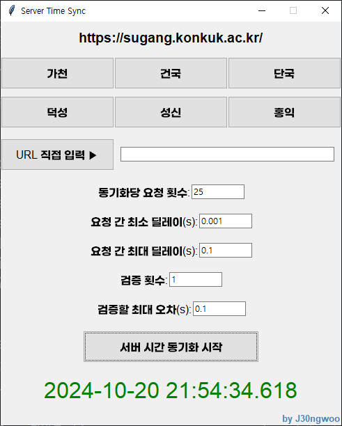

### 서버와의 오차를 측정하여, 서버에 요청이 도달하는 시간을 표시해주는 타이머

## ❗주의사항❗
- 서버에 여러 번의 요청을 보내 정확한 시간을 측정하므로, 짧은 시간 내에 너무 많은 동기화 시도 시 주의하세요.
- 서버와의 오차가 적용되어 있는 타이머이므로, 타이머 기준 정각 이전(59분 59초)에 예측하여 클릭하는 것이 아니라 ***정각(00분 00초)*** 에 수강신청·예약·전송 버튼을 눌러야 합니다.
- exe파일이 실행되지 않는 경우
  - 추가 정보 -> 실행
  - exe파일 우클릭 -> 속성 -> 일반 -> 차단 해제 -> 실행
- 서버 응답 로직에 따라 시간을 측정할 수 없는 사이트도 있습니다.
## 사용 방법

0. 오른쪽 위 Code 버튼 -> Download Zip
1. `main.py` 혹은 `main.exe` 실행
2. URL 선택 혹은 직접 입력 (직접 입력 시 입력 후 버튼 클릭)
3. 동기화 시작 버튼 클릭

## 변수 설명
- **동기화당 요청 횟수**: 오차를 측정할 때 전송할 요청의 횟수입니다. 20 이상을 권장하고, 너무 적을 시 검증 실패 확률이 증가할 가능성이 있습니다. (기본값 25회)
- **요청 간 최소/최대 딜레이**: 여러 번의 요청을 전송할 때 적용할 요청 간의 딜레이입니다. 수정할 필요 없습니다.
- **검증**: 동기화 이후, 오차를 가정하여 검증합니다. 오차를 벗어날 시 동기화 실패로 간주합니다. 검증 횟수가 증가하면 실패할 가능성이 높아집니다. (기본값 1회) 
- **검증할 최대 오차**: 서버나 네트워크 상태가 불안정하여 너무 많이 실패할 경우 최대 오차값을 높이세요. (기본값 0.1s) 
  - ex) 최대 오차를 0.1s로 설정한다면 -> 0.900초에 요청 시 0초, 1.000초에 요청 시 1초에 도달함을 검증합니다.
