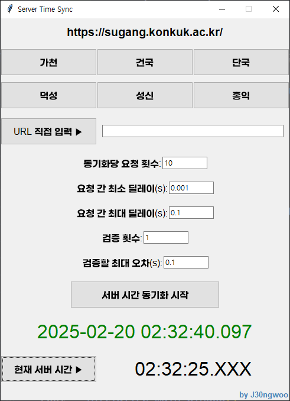

### 서버와의 오차를 측정하여, 서버에 요청이 도달하는 시간을 표시해주는 타이머

## ▶소개
- 서버 시간을 측정할 때, 서버에서는 `초 단위`까지 응답합니다. 따라서 네이버 시계, 네이비즘 등 기존 서비스는 1초 이상의 오차가 발생할 수 있습니다.
- 따라서 서버에 여러 번의 요청을 통해 오차를 측정하여, `ms 단위`까지 표시되는 타이머를 만들었습니다.
- 서버 시간과의 오차가 적용되어 있는 타이머이므로, 타이머 시간 기준 정각 이전(59분 59초)에 예측하여 클릭하는 것이 아니라 ***정각(00분 00초)*** 에 `<수강신청·예약> 버튼`을 눌러야 합니다.
- 네트워크 상태가 원활하여야 하므로 무선 네트워크(wifi) 대신 유선 네트워크(LAN선) 환경을 권장합니다.
- exe파일이 실행되지 않는 경우
  - 추가 정보 -> 실행
  - exe파일 우클릭 -> 속성 -> 일반 -> 차단 해제 -> 실행
 
## 🔥사용 방법

0. 오른쪽 위 Code 버튼 -> Download Zip
1. `main.py` 혹은 `main.exe` 실행
2. URL 선택 혹은 직접 입력 (직접 입력 시 `URL 직접 입력` 버튼 클릭)
3. 동기화 시작 버튼 클릭

## 🚫주의사항
- 서버에 여러 번의 요청을 보내 오차를 측정하므로 짧은 시간 내에 너무 많은 동기화 시도 시에 주의하세요. **모든 요청은 사용자의 컴퓨터에서 서버로 전송됩니다. 과도한 트래픽 발생으로 문제가 생길 수 있습니다.**
- 서버 응답 로직에 따라 시간을 측정할 수 없는 사이트도 있습니다.

## ✅테스트 버튼 추가!
- 현재 서버 시간을 받아와 연습할 수 있도록 하단에 `현재 서버 시간 테스트 버튼`을 추가하였습니다.
- 서버에서 받아오는 시간은 `초 단위`이므로, `ms 단위`는 알 수 없습니다. (표시된 시간이 10초일 경우, 10.000초 ~ 10.999초가 가능)
- `동기화 타이머`가 59초에서 00초로 넘어갈 때 클릭하여 감각을 연습해 보세요. 넘어가자마자 클릭하되, 59초가 아닌 **00초**가 표시되어야 성공입니다.
- **클릭 시마다 서버로 요청이 전송되므로, 너무 많이 누르지 마세요.**

## 설정값 설명

- **동기화당 요청 횟수**: 오차를 측정할 때 전송할 요청의 횟수입니다. 20 이상을 권장하며, 너무 적을 시 검증에 실패할 수 있습니다. (기본값 25회)
- **요청 간 최소/최대 딜레이**: 여러 번의 요청을 전송할 때 적용할 요청 간의 딜레이입니다. 수정할 필요 없습니다.
- **검증**: 동기화 이후, 오차를 가정하여 검증합니다. 오차를 벗어날 시 동기화 실패로 간주합니다. 검증 횟수가 증가하면 정확도가 증가하지만, 검증에 실패할 가능성도 높아집니다. (기본값 1회) 
- **검증할 최대 오차**: 서버나 네트워크 상태가 불안정하여 너무 많이 실패할 경우 최대 오차값을 높이세요. (기본값 0.1s) 
  - ex) 최대 오차를 0.1s로 설정한다면 -> 0.900초에 요청 시 0초, 1.000초에 요청 시 1초에 도달함을 검증합니다.
